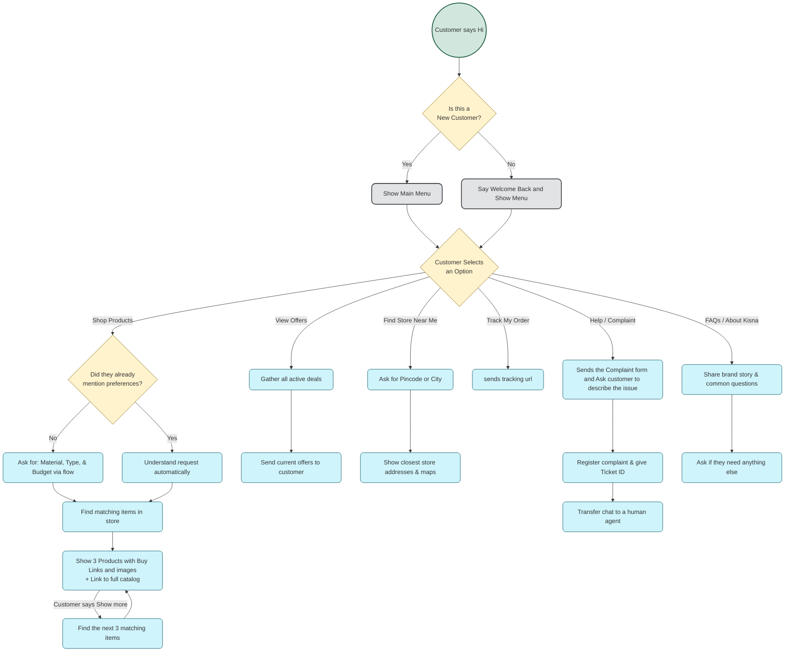

# Kisna Chatbot — Customer Journey

This flowchart maps the end-to-end customer journey for the Kisna jewellery brand chatbot on WhatsApp. It covers greeting, the main menu, and all six customer intents using plain business language suitable for stakeholder and client reviews.

## Legend

| Color | Node type | Meaning |
|-------|-----------|---------|
| Green | Trigger | How the conversation starts |
| Yellow | Logic | Decision points where the bot chooses what to do next |
| Blue | Action | Steps the bot takes to help the customer |
| Grey | Menu | Menu screens shown to the customer |

## Customer Journey Flowchart

